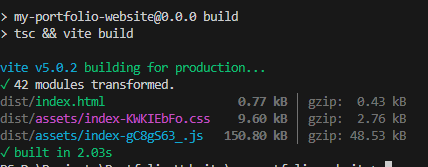
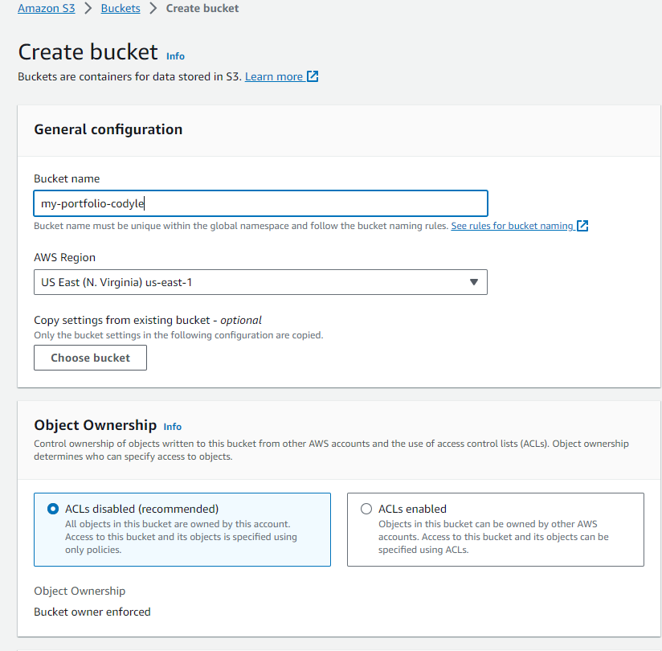
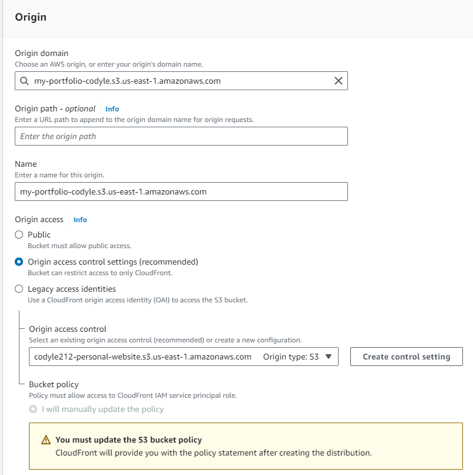
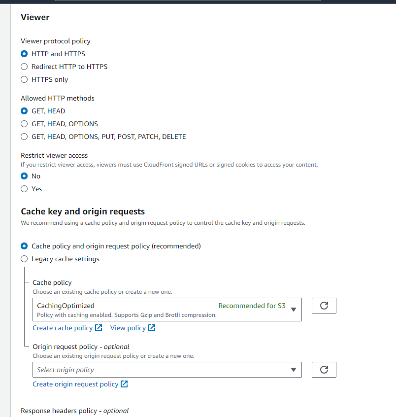
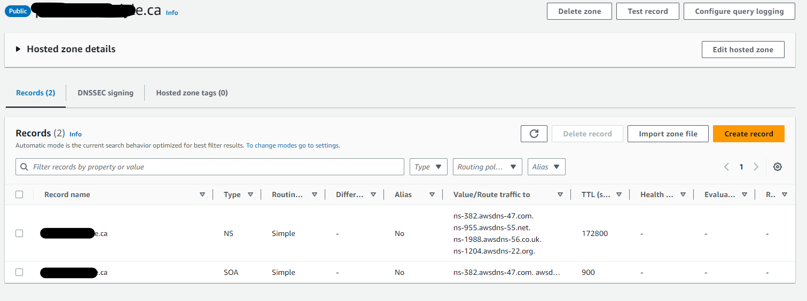
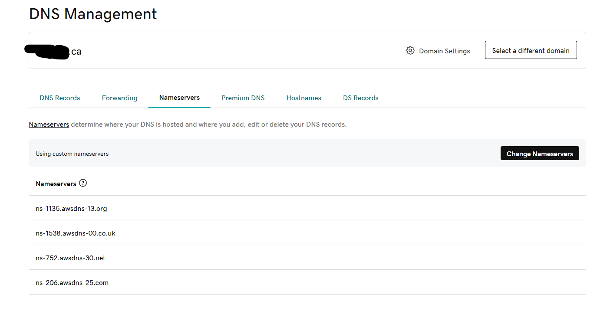
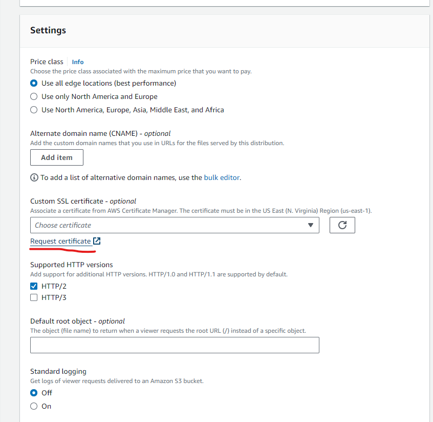
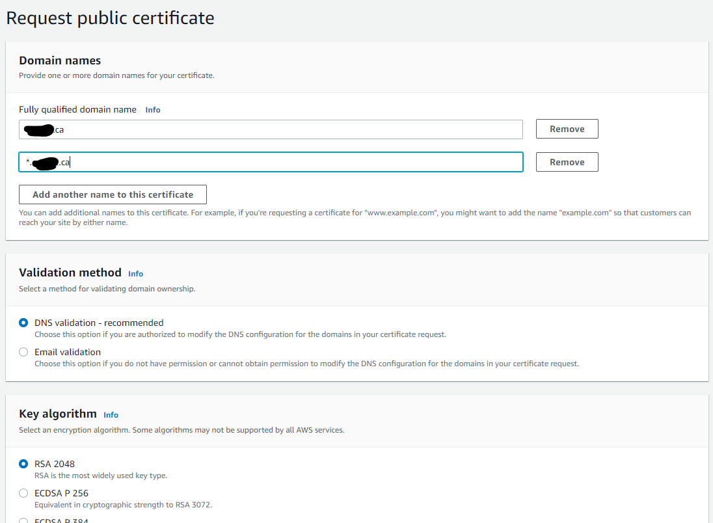
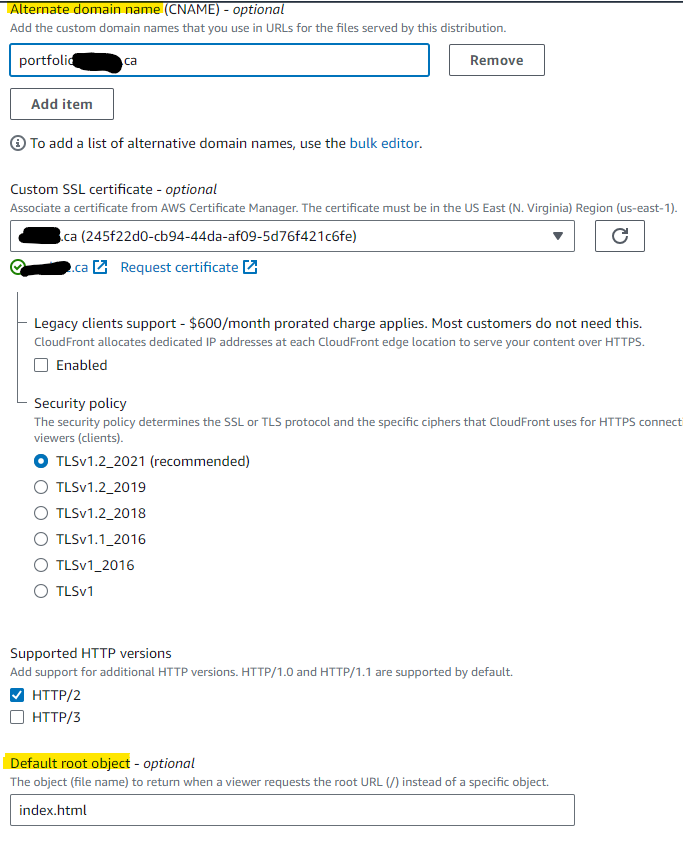
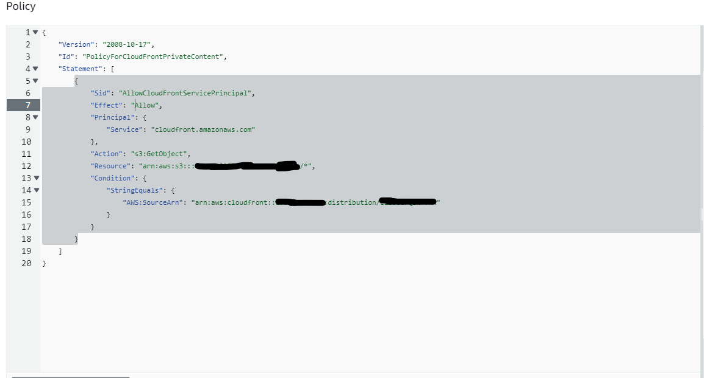

# Hosting Steps for Portfolio-Website

1. Run `npm run build` to create static files
   
2. Create S3 Bucket for Static Files, enter name and leave everything as default
   
3. Upload Static Files to S3 Bucket
   
4. Create a Cloudfront Distribution to server static files,select the previously created S3 Bucket
   
5. Leave the Viwer Section as Default, No need to change
   
6. If Domain is in other registrar, create a public hosted zone and point NS record to the NS AWS provides
   
   
7. Create a public Certificate base on your registered domain, in Settings section of Cloudfront Distribution create process
   
   
8. Select the Cert you created, Add a Custom Domain under your Registered Domain, Set Default Root to `index.html`,Click Create
   
9. Go to your S3 Bucket can change the bucket policy, to allow the created Cloudfront Distribution access
   
